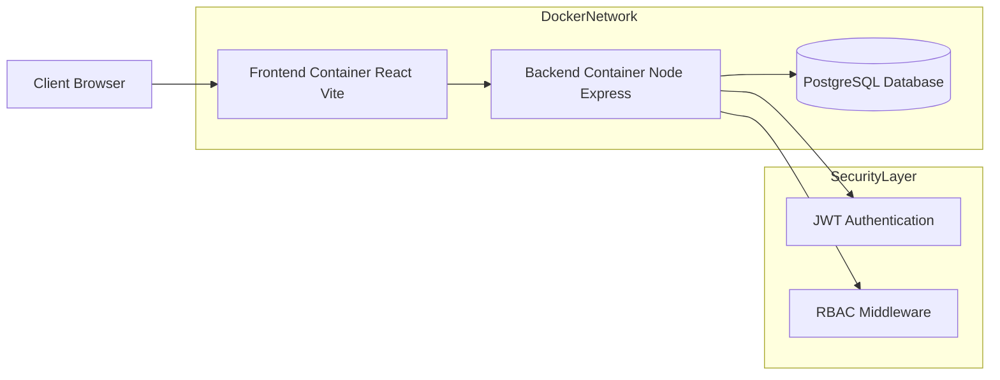
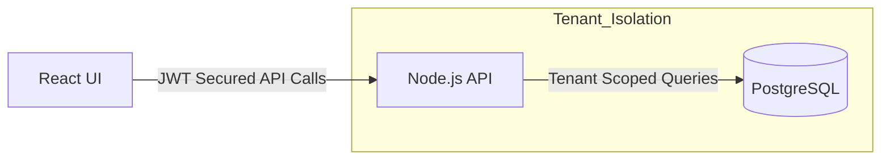
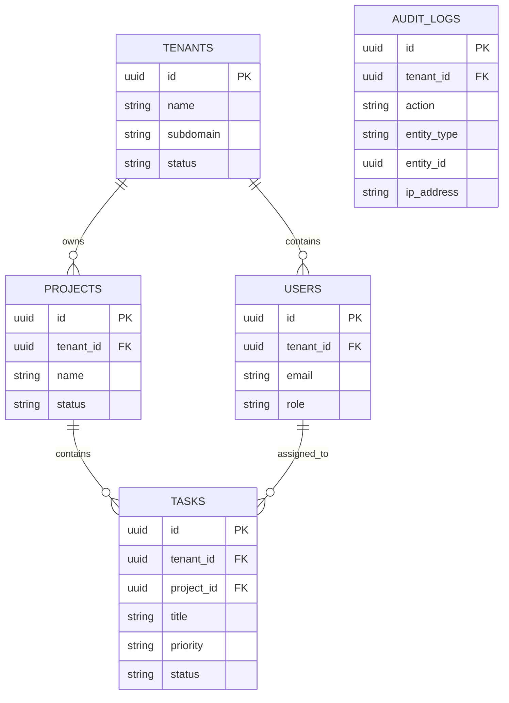

# System Architecture Document

**Project Name:** Multi-Tenant SaaS Project Management System  
**Date:** October 26, 2025  
**Version:** 1.0  
**Author:** Sam  

---

## 1. System Architecture Design

The system follows a **containerized three-tier web architecture** designed for modularity, scalability, and tenant isolation.  
The entire stack is orchestrated using **Docker Compose**, ensuring environment consistency across development and production.

---

## High-Level Architecture Diagram



## System Architecture & Components

The application follows a multi-tenant SaaS architecture where all tenants share the same application and database while maintaining logical isolation at the data and access-control levels.

---

## Components Description

### Client Layer (Frontend)

- **Technology:** React.js (Vite)
- **Container Port:** `3000 (External) → 3000 (Internal)`
- **Responsibilities:**
  - Display user interfaces for all roles
  - Collect user input and manage UI state
  - Store JWT securely on the client
  - Send authenticated API requests
- **Tenant Identification:**
  - Tenant is resolved after login
  - Tenant context is embedded inside the JWT

---

### Application Layer (Backend API)

- **Technology:** Node.js, Express.js
- **Container Port:** `5000 (External) → 5000 (Internal)`
- **Responsibilities:**
  - Process API requests
  - Authenticate users using JWT
  - Authorize actions using RBAC
  - Enforce tenant-level data access
- **Tenant Isolation Logic:**
  - Middleware extracts tenant_id from JWT
  - Queries are automatically filtered by tenant_id
  - Prevents cross-tenant data exposure

---

### Data Layer (Database)

- **Technology:** PostgreSQL 
- **Container Port:** `5432 (External) → 5432 (Internal)`
- **Responsibilities:**
  - Store tenant and application data
  - Maintain relational integrity
- **Isolation Strategy:**
  - **Shared database and schema**
  - Logical separation via tenant_id
  - Indexed tenant columns for performance

---

## High-Level System Architecture (Mermaid)



## Database Schema Design (ERD)

The database is designed using normalized relational principles.
Each tenant-owned entity includes a tenant_id column, which acts as the logical boundary between tenants.

The `tenant_id` column acts as the **logical partition key** for multi-tenancy, enabling secure data isolation within a **shared database, shared schema** model.



## Schema Details

### `tenants` (Root Entity)
- Stores organization-level information
- **Primary Key:** `id (UUID)`
- **Data:**
  - `name`
  - `subdomain` (Unique)
  - `status`
  - `subscription_plan`
- **Constraints:**
  - `max_users`
  - `max_projects`
- **Isolation:**
  - Root table (no `tenant_id` column)

---

### `users`
- **Primary Key:** `id (UUID)`
- **Foreign Key:**
  - `tenant_id → tenants.id` (`ON DELETE CASCADE`) **[ISOLATION KEY]**
- **Data:**
  - `email`
  - `password_hash`
  - `full_name`
  - `role`
- **Constraint:**
  - `UNIQUE (tenant_id, email)`  
    (Emails are unique per tenant)

---

### `projects`
- **Primary Key:** `id (UUID)`
- **Foreign Keys:**
  - `tenant_id → tenants.id` (`ON DELETE CASCADE`) **[ISOLATION KEY]**
  - `created_by → users.id`
- **Data:**
  - `name`
  - `description`
  - `status`
- **Index:**
```sql
CREATE INDEX idx_projects_tenant ON projects(tenant_id);
```

### `tasks`
- **Primary Key:** `id (UUID)`
- **Foreign Keys:**
  - `project_id → projects.id` (`ON DELETE CASCADE`)
  - `tenant_id → tenants.id` **[ISOLATION KEY]**
  - `assigned_to → users.id` (Nullable)
- **Data:**
  - `title`
  - `priority`
  - `status`
  - `due_date`
- **Index:**
```sql
CREATE INDEX idx_tasks_tenant ON tasks(tenant_id);
```

### `audit_logs`
- **Primary Key:** `id (UUID)`
- **Foreign Key:**
  - `tenant_id → tenants.id` **[ISOLATION KEY]**
- **Data:**
  - `action`
  - `entity_type`
  - `entity_id`
  - `ip_address`

---

## API Architecture

The backend exposes RESTful APIs that follow standard HTTP conventions.
All endpoints are stateless and secured using JWT authentication.

### Standard API Response Format

All API responses follow a consistent structure:

```json
{
  "success": true,
  "message": "Request completed successfully",
  "data": {}
}

```

### Module A: Authentication

| Method | Endpoint                    | Description             | Auth | Role   |
| -----: | --------------------------- | ----------------------- | ---- | ------ |
|   POST | `/api/auth/register-tenant` | Create tenant and admin | No   | Public |
|   POST | `/api/auth/login`           | User login              | No   | Public |
|    GET | `/api/auth/me`              | Current user info       | Yes  | Any    |
|   POST | `/api/auth/logout`          | Logout                  | Yes  | Any    |

### Module B: Tenant Management

| Method | Endpoint                 | Description       | Auth | Role        |
| -----: | ------------------------ | ----------------- | ---- | ----------- |
|    GET | `/api/tenants`           | Fetch all tenants | Yes  | Super Admin |
|    GET | `/api/tenants/:tenantId` | Tenant details    | Yes  | Super Admin |
|    PUT | `/api/tenants/:tenantId` | Update tenant     | Yes  | Super Admin |


### Module C: User Management

| Method | Endpoint                       | Description | Auth | Role          |
| -----: | ------------------------------ | ----------- | ---- | ------------- |
|   POST | `/api/tenants/:tenantId/users` | Add user    | Yes  | Tenant Admin  |
|    GET | `/api/tenants/:tenantId/users` | List users  | Yes  | Tenant Member |
|    PUT | `/api/users/:userId`           | Update user | Yes  | Self / Admin  |
| DELETE | `/api/users/:userId`           | Delete user | Yes  | Tenant Admin  |


### Module D: Project Management

| Method | Endpoint                   | Description    | Auth | Role          |
| -----: | -------------------------- | -------------- | ---- | ------------- |
|   POST | `/api/projects`            | Create project | Yes  | Tenant Member |
|    GET | `/api/projects`            | List projects  | Yes  | Tenant Member |
|    PUT | `/api/projects/:projectId` | Update project | Yes  | Owner / Admin |
| DELETE | `/api/projects/:projectId` | Delete project | Yes  | Owner / Admin |


### Module E: Task Management

| Method | Endpoint                         | Description        | Auth | Role          |
| -----: | -------------------------------- | ------------------ | ---- | ------------- |
|   POST | `/api/projects/:projectId/tasks` | Create task        | Yes  | Tenant Member |
|    GET | `/api/projects/:projectId/tasks` | List tasks         | Yes  | Tenant Member |
|  PATCH | `/api/tasks/:taskId/status`      | Update task status | Yes  | Tenant Member |
|    PUT | `/api/tasks/:taskId`             | Update task        | Yes  | Tenant Member |

