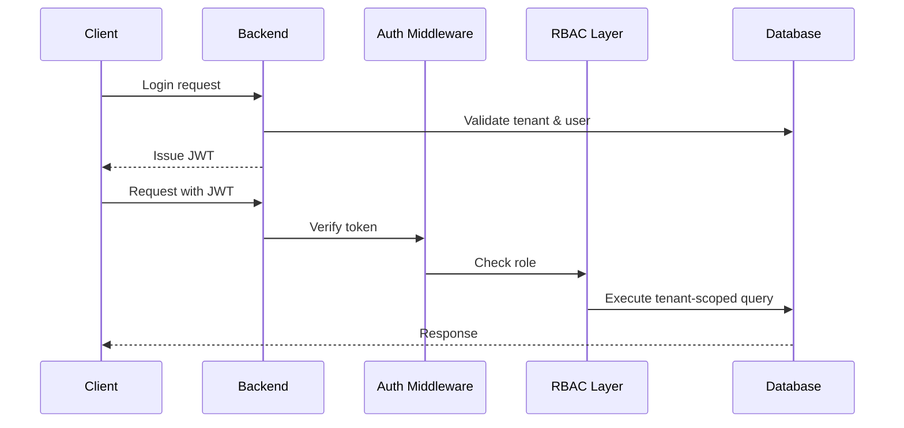

# Research Document: Multi-Tenant SaaS Platform Architecture

**Project Name:** Multi-Tenant SaaS Project Management System  
**Date:** October 26, 2025  
**Author:** Sam  
**Status:** Approved for Implementation  

---

## 1. Multi-Tenancy Architecture Analysis

Multi-tenancy refers to an architectural model where a single software system supports multiple independent customer organizations while maintaining strict separation of their data, users, and operations. In SaaS platforms, this model enables cost efficiency and scalability while still meeting security expectations.

One of the most impactful architectural choices in a multi-tenant SaaS system is how tenant data is stored and isolated at the database level. The following sections evaluate three commonly adopted database strategies used in industry-grade SaaS applications.

---

### A. Shared Database, Shared Schema (Discriminator Column)

This model uses a **single database and a single schema** for all tenants. Each table contains a column such as `tenant_id` to identify which tenant owns a record.

**How It Works**
- All tenants share the same tables
- Every tenant-related query is filtered using `tenant_id`
- Isolation logic is handled by the application layer

**Advantages**
- Minimal infrastructure and operational cost
- Very fast tenant onboarding
- Simple database management and monitoring
- Ideal for early-stage and growing SaaS platforms

**Limitations**
- Strong discipline required in query implementation
- Tenant-specific backup and restore operations are difficult
- Performance issues may occur if indexing is not optimized

---

### B. Shared Database, Separate Schemas (Schema-per-Tenant)

In this approach, tenants share the same database server but operate within their own schemas. Each tenant’s data exists in a separate namespace.

**How It Works**
- One database instance
- One schema per tenant
- Application dynamically selects the tenant schema per request

**Advantages**
- Improved isolation compared to shared schema
- Easier tenant-level backups
- Reduced risk of accidental cross-tenant access

**Limitations**
- Schema migrations become complex with many tenants
- Database metadata grows quickly
- Operational complexity increases over time

---

### C. Separate Databases (Database-per-Tenant)

This strategy assigns a fully independent database to each tenant, offering physical data separation.

**How It Works**
- One database per tenant
- Tenant-to-database mapping maintained by the application
- Complete isolation at the database level

**Advantages**
- Strongest isolation and security
- No performance interference between tenants
- Suitable for compliance-driven organizations

**Limitations**
- High infrastructure and maintenance cost
- Complex deployment and monitoring
- Not suitable for high-volume SaaS onboarding

---

### Comparison Summary

| Aspect | Shared Schema | Separate Schema | Separate Database |
|------|---------------|-----------------|------------------|
| Tenant Isolation | Basic | Moderate | Strong |
| Infrastructure Cost | Low | Medium | High |
| Maintenance Effort | Low | Medium | High |
| Onboarding Speed | Instant | Fast | Slow |
| Scalability | High | Medium | Low |
| Backup Flexibility | Low | Medium | High |

---

### Chosen Approach: Shared Database + Shared Schema

**Reason for Selection**

The shared database with shared schema approach was selected because it aligns best with the project’s scale, budget, and deployment strategy.

Key reasons include:
1. Enables rapid onboarding of new tenants without database provisioning
2. Works efficiently with containerized deployments
3. Reduces operational overhead
4. Scales well when combined with strict middleware enforcement

Tenant isolation is enforced through backend middleware that automatically injects the correct `tenant_id` into every database query, eliminating reliance on client-supplied values.

---

## 2. Technology Stack Justification

This section explains the reasoning behind the technology choices made for the platform, focusing on scalability, maintainability, and long-term viability.

---

### Backend: Node.js with Express

Node.js was selected for its non-blocking architecture, which is well suited for handling concurrent API requests.

**Why Selected**
- Efficient request handling
- Middleware-driven architecture
- Large ecosystem and community
- Easy JWT and RBAC integration

**Alternatives Considered**
- Django: heavier runtime and synchronous design
- Spring Boot: higher complexity and resource usage

---

### Frontend: React (Vite)

React was chosen to build a responsive and interactive user interface for dashboards and project views.

**Why Selected**
- Component-based UI design
- Strong ecosystem and tooling
- Fast development with Vite

**Alternatives Considered**
- Angular: steeper learning curve

---

### Database: PostgreSQL

PostgreSQL was selected for its reliability, strong relational features, and support for advanced constraints.

**Why Selected**
- ACID compliance
- Strong indexing and joins
- Mature ecosystem

**Alternatives Considered**
- MongoDB: weaker relational guarantees

---

### Authentication: JWT

JWT was chosen as the authentication mechanism due to its stateless nature and scalability.

**Why Selected**
- No server-side session storage
- Easy horizontal scaling
- Works well with APIs

**Alternatives Considered**
- Session-based authentication

---

### Deployment: Docker & Docker Compose

Docker ensures consistency across environments and simplifies service orchestration.

**Why Selected**
- Environment parity
- Simplified deployments
- Easy local setup

---

## 3. Security Considerations

Security is a core concern in multi-tenant systems due to shared infrastructure. Multiple defensive layers are implemented to protect tenant data.

---

### Measure 1: Application-Level Tenant Isolation

- Tenant context is derived from JWT
- Backend enforces tenant filtering
- Client input is never trusted for tenant identification

---

### Measure 2: Password Protection

- Passwords are hashed using bcrypt
- Salt rounds configured to industry standards
- Plaintext passwords are never stored

---

### Measure 3: Role-Based Access Control (RBAC)

| Role | Permissions |
|------|------------|
| Super Admin | Global administrative control |
| Tenant Admin | Tenant-wide management |
| User | Limited task and project access |

Authorization checks occur before any database interaction.

---

### Measure 4: API Security Controls

- Rate limiting on sensitive endpoints
- CORS policy enforcement
- Secure HTTP headers

---

### Measure 5: Input Validation & Query Safety

- Request payload validation
- Parameterized database queries
- Protection against injection attacks

---

### Data Isolation Strategy

All tenant-owned tables include a `tenant_id` column. Queries are always scoped using the tenant context extracted from authentication tokens.

```sql
SELECT *
FROM projects
WHERE id = :projectId
AND tenant_id = :tenantId;
```
## Authentication & Authorization Flow
  - User submits credentials and tenant identifier
  - Backend resolves tenant context
  - Credentials are validated
  - JWT is generated containing user and tenant claims
  ```json
  {
  "userId": "<uuid>",
  "tenantId": "<uuid>",
  "role": "<role>"
  }
  ```
  - Client includes JWT in subsequent requests
  - Middleware validates token and role permissions

